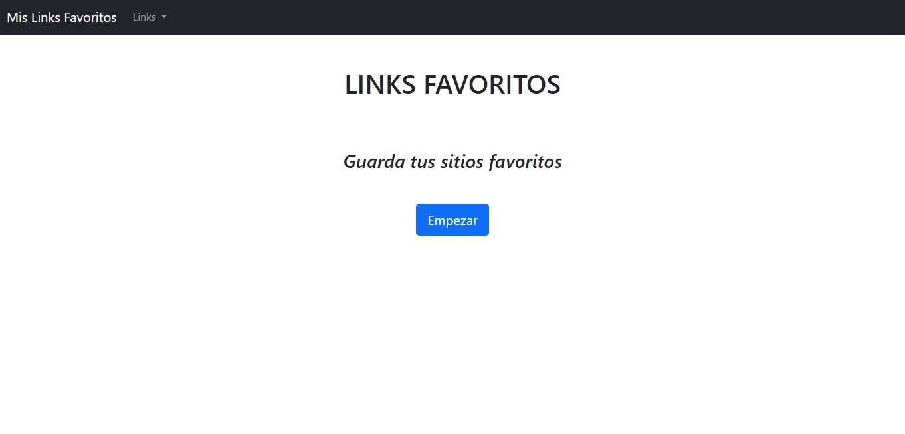
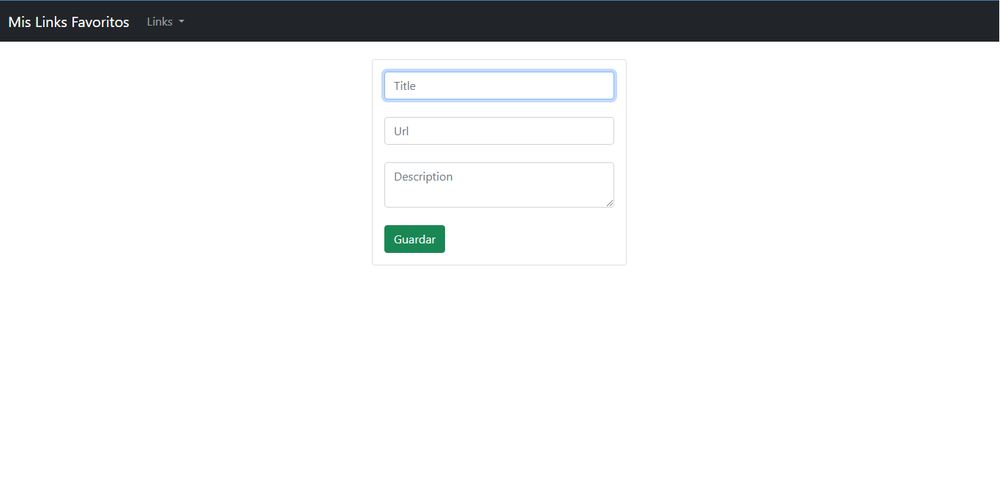
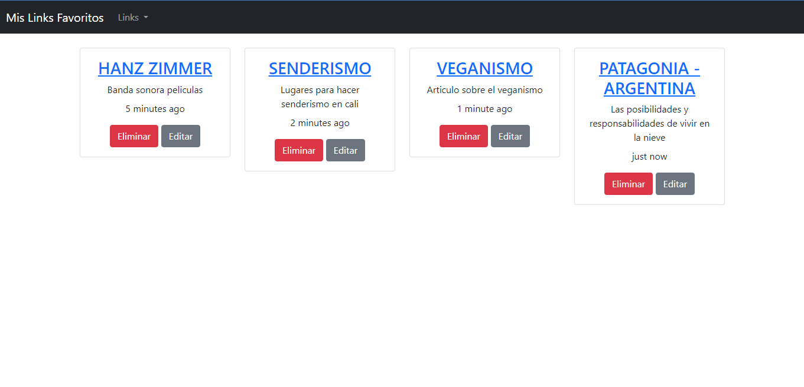

# Links-app

## Tecnologías Utilizadas

+ Node.js
+ Express
+ MySQL 
+ Handlebars  

## Descripción

Esta app permite guardar mis links favoritos con nombre y una descripción breve del mismo. Tambien eliminar y editarlos. 

## Como se ve Links-app

+ ### Landing Page

+ ### Creacion

+ ### Almacenamiento

